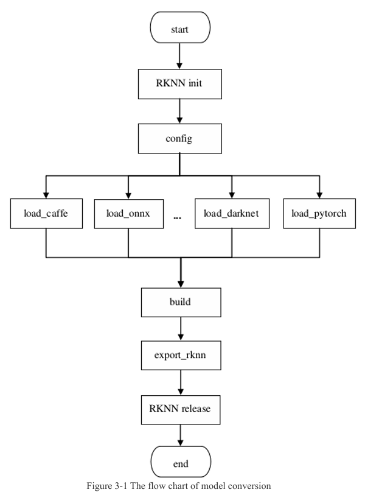

## Convert to RKNN Model

### Directory

이 프로젝트는 Docker Compose를 사용하여 실행할 수 있도록 아래와 같이 디렉토리를 구성했습니다.

```
Converter
 ┣ app
 ┃ ┣ convert.py
 ┃ ┗ yolov5.onnx
 ┣ res
 ┃ ┣ rknn_toolkit2-2.3.2-cp38-cp38-manylinux_2_17_x86_64.manylinux2014_x86_64.whl
 ┃ ┗ sources_bionic.list
 ┣ docker-compose.yaml
 ┗ Dockerfile_ubuntu_20_04_for_cp38
```
- app 디렉토리에는 convert.py와 ONNX 형식의 모델 파일인 yolov5.onnx가 위치합니다.
- res 디렉토리에는 Dockerfile에 의존하는 .whl 파일과 sources_bionic.list 파일이 위치합니다.
- 상위 디렉토리에는 docker-compose.yaml 파일과 Dockerfile이 존재합니다.
- Dockerfile 및 관련 종속 파일은 [rknn-toolkit2/dockerfile](https://github.com/airockchip/rknn-toolkit2/tree/master/rknn-toolkit2/docker/docker_file/ubuntu_20_04_cp38)에서 가져와 사용했습니다.  

### convert.py
convert.py는 [RKNPU User Guide EN](https://github.com/airockchip/rknn-toolkit2/blob/master/doc/02_Rockchip_RKNPU_User_Guide_RKNN_SDK_V2.3.2_EN.pdf) 중 3.1 Model Conversion을 참고하여 작성되었습니다.  



위 가이드에 따라 RKNN 초기화, 설정, ONNX 모델 로드, 빌드, RKNN 형식으로 내보내기, 리소스 해제를 위한 코드를 작성하여, ONNX 형식의 모델을 RKNN 형식으로 변환하는 기능을 구현했습니다.  

### Docker-compose
docker-compose.yaml은 다음과 같이 작성했습니다.  

```yaml
version: '3.8'

services:
  rknn-env:
    build:
      context: .
      dockerfile: Dockerfile_ubuntu_20_04_for_cp38
    volumes:
      - ./app:/app 
    working_dir: /app 
    command: ["python", "convert.py"]
```

이후, 아래 명령어로 Docker Compose를 실행합니다.

```bash
sudo docker compose up -d
```

실행이 완료되면, app 디렉토리 내에 yolov5.rknn 모델이 생성된 것을 확인할 수 있습니다.

```
Converter
 ┣ app
 ┃ ┣ convert.py
 ┃ ┣ yolov5.onnx
 ┃ ┗ yolov5.rknn
 ┣ res
 ┃ ┣ rknn_toolkit2-2.3.2-cp38-cp38-manylinux_2_17_x86_64.manylinux2014_x86_64.whl
 ┃ ┗ sources_bionic.list
 ┣ docker-compose.yaml
 ┗ Dockerfile_ubuntu_20_04_for_cp38
```