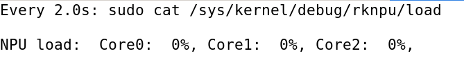
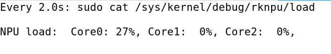
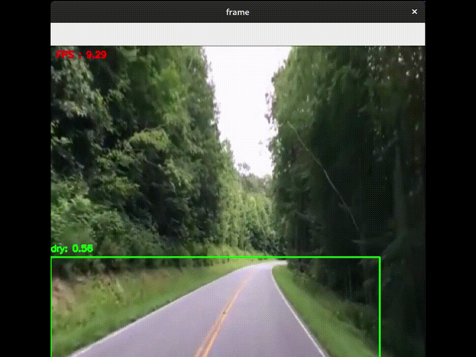
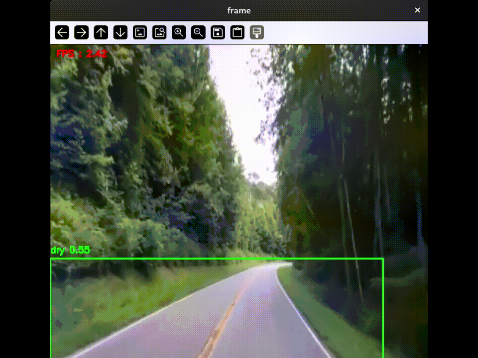

## Experimental

### 목적
본 실험의 목적은 다음과 같습니다.

- Torch를 이용한 Detection 추론 시, 프레임 속도 저하가 심하게 발생
- Orange Pi 5 보드에 탑재된 RKNPU(Rockchip Neural Processing Unit)를 활용하면 프레임 속도 개선이 가능한지 확인

### RKNPU 사용 여부 판단
RKNPU의 사용 여부는 아래 명령어로 실시간 확인할 수 있습니다.  

```bash
watch sudo cat /sys/kernel/debug/rknpu/load
```

명령어 실행 시, 아래 이미지와 같이 NPU Core의 사용률이 나타납니다.  
| RKNPU 비활성화 | RKNPU 활성화 |
|:-------:|:-------:|
|  |  |

### 실험 결과 비교
동일한 MP4 영상을 기반으로 Torch 모델과 RKNN 모델 각각에 대해 실시간 Detection 추론을 수행하였습니다.  
실험 결과, RKNPU를 활용한 추론이 CPU 기반 Torch 모델 추론보다 영상 처리 성능에서 뚜렷한 우위를 보였습니다.  

| RKNN Model | Torch Model |
|:-------:|:-------:|
|  |  |

- RKNPU (RKNN 모델): 평균 7~8 FPS
- CPU (Torch 모델): 평균 1.6~2.2 FPS

위 결과에서 볼 수 있듯, On-Device에서 RKNPU 기반 추론이 실시간 처리에 훨씬 적합함을 확인할 수 있습니다.  