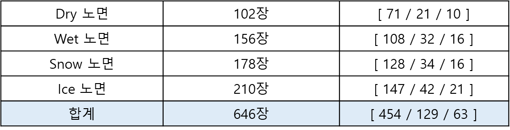

## Model

본 프로젝트는 도로의 노면 상태를 감지하고 해당 상태를 알려주는 AI 시스템입니다.
이를 위해 데이터셋 구축과 모델을 아래와 같이 설계했습니다.  

### Dataset
도로 노면 데이터셋은 Roboflow를 활용하여 라벨링 작업을 진행했습니다.  
전체 이미지 수는 646장이며, 학습(Train), 검증(Valid), 테스트(Test) 데이터 비율은 각각 7:2:1로 설정했습니다.  

각 클래스별 이미지 수는 아래와 같습니다.  

### Model과 Training
도로 노면을 감지하는 AI 모델은 객체 탐지(Object Detection) 모델인 YOLO를 사용했습니다.  
YOLO 모델 학습은 Google Colab 환경에서 진행되었습니다. 

모델 학습 방법에 대한 자세한 내용은 [Model-to-Onnx.ipynb](./Model-to-Onnx.ipynb) 파일을 참고하세요.  

### ONNX와 RKNN
> **Link**  
> - [rknn-toolkit2](https://github.com/airockchip/rknn-toolkit2)  
> - [rknn model zoo - yolov5](https://github.com/airockchip/rknn_model_zoo/tree/main/examples/yolov5)

본 프로젝트는 임베디드 보드인 Orange Pi 5를 활용하며, 이 보드는 RKNPU를 탑재하고 있습니다.  
RKNPU는 RKNN 모델의 연산을 지원하며, RKNN 모델 변환을 위한 소프트웨어가 GitHub에 공개되어 있습니다.

YOLOv5 모델을 RKNN 형식으로 변환하기 위해, 먼저 ONNX 형식으로 모델을 저장한 후, 이를 RKNN 형식으로 변환했습니다.  
YOLOv5 모델의 RKNN 형식 변환에 대한 참고사항은 위 링크에서 확인하실 수 있습니다.
