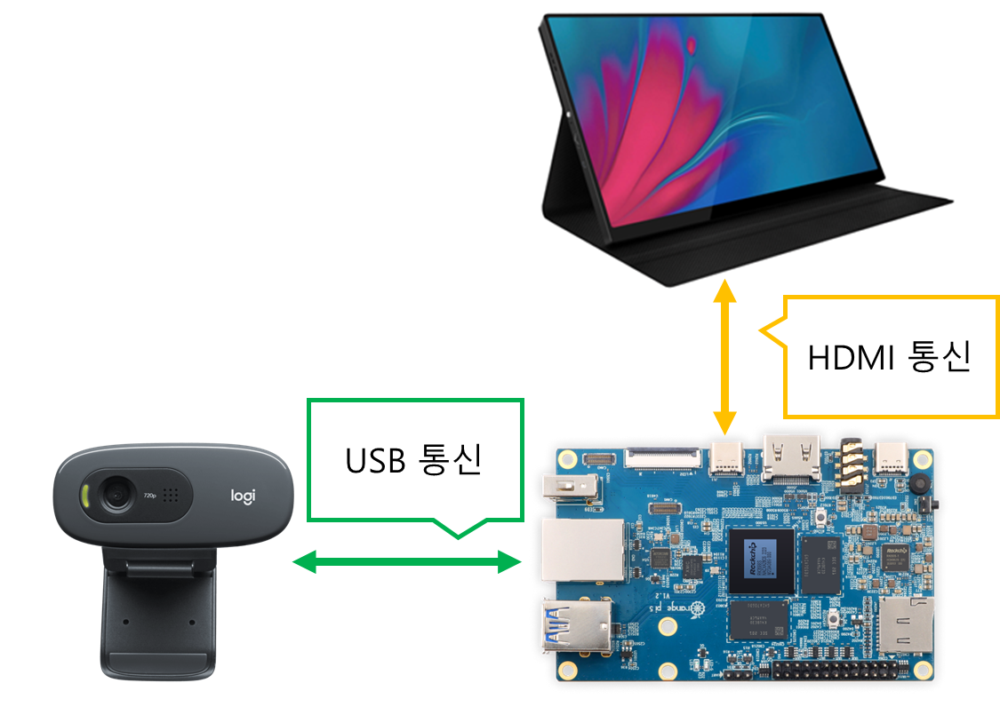

## Road Surface Detection System

### Introduction

#### 목표
도로의 영상정보를 이용하여 Dry, Wet, Snow, Ice 4종류로 분류하는 AI기반 도로노면상태 판단 기술 개발

#### 필요성
- ‘20~’22년 빗길 교통사고 사망자 776명, 건조한 노면 대비 치사율이 1.5배
- ‘17~’21년 결빙(블랙아이스) 교통사고 사망자 122명, 전체 교통사고 치사율 대비 1.5배

#### 기대효과
- Wet 노면의 경우, 차량속도에 따라 노면마찰계수가 작아지는 특징이 있음
- 블랙아이스 노면의 경우, 사람의 눈으로 구분이 어려운 점이 있음
- Wet, Ice 노면을 판단해줌으로써 사고 발생 위험을 줄여주는 효과 기대

### System 전체 과정
1. Roboflow를 활용한 이미지 데이터 라벨링
2. Yolov5(Yolov8) Model 학습 및 onnx 형식으로 모델 추출 [(🔗)](./Model)
3. rknn-toolkit2를 활용하여 onnx을 rknn 형식으로 변환 [(🔗)](./Converter)
4. rknn-toolkit-lite2를 활용하여 rknpu에 rknn 모델을 추론 및 opencv로 Detection System 동작 [(🔗)](./System)

### Experimental
NPU가 탑재된 임베디드 보드를 활용하여,  
실시간 영상 추론 시 NPU 사용 여부에 따른 성능 차이를 확인하고자 다음과 같은 실험을 진행하였습니다.  

실험 결과 요약:
- RKNPU (RKNN 모델): 평균 7~8 FPS
- CPU (Torch 모델): 평균 1.6~2.2 FPS

자세한 내용 및 결과는 [Experimental](./Experimental/) 에서 확인하세요.  

### System 구성도

| **구분** | **제품명** | **기능** |
| --- | --- | --- |
| **보드** | Orange Pi 5 | 초소형, 저전력 컴퓨터 |
| **운영체제** | Armbian | Debian계열 운영체제 |
| **모니터** | ZEUSLAP Z10T | 터치 O, 소리 출력 O |
| **카메라** | Logitech c270 | 720p(HD급) 영상 화질 출력 |